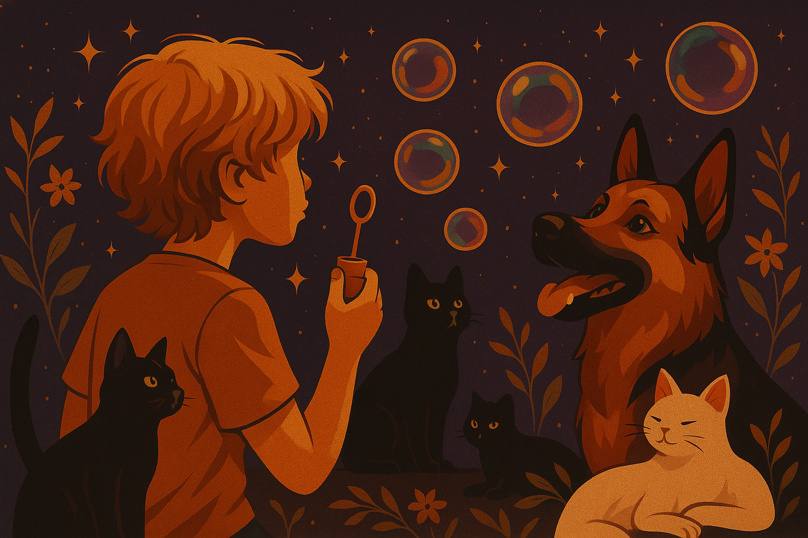

  

# Olá, eu sou a Diane • Software Quality & Criatividade

"Assim como cada ponto no crochê dá forma a uma peça única, cada teste bem tecido sustenta a estrutura de um sistema.”

Sou curiosa, detalhista e adoro transformar coisas simples em algo especial.
Trabalho na área de qualidade de software, com um olhar curioso, atenção aos detalhes e leveza no processo. Mas não vivo só de tecnologia: também tenho meu lado criativo, onde coloco as mãos no crochê para criar mandalas, filtros dos sonhos e peças cheias de cor no meu projeto Flor de Novembro.
Gosto de olhar pela perspectiva que o artesanato combina muito com a qualidade. Capa ponto importa, cada pixel pode fazer a diferença. O artesanato me ajudou a ser a QA que sou hoje e a prestar atenção em cada ponto pensando na entrega final, onde nos dois a qualidade é fundamental 🌷

Sou mãe do Gael 💙, meu pequeno parceiro de aventuras, jogos, descobertas e às vezes até de testes. 

Gosto de pensar que tudo o que faço, seja no digital ou no artesanal, leva sempre um pouco de cuidado, afeto e cores para o mundo.

---

<!-- Divisória temática -->

  

 Habilidades & Competências </h1>

<table>
  <tr>
    <!-- COLUNA 1: QUALIDADE DE SOFTWARE -->
    <td width="50%" valign="top">

 

<table>
  <tr>
    <!-- COLUNA 1: QUALIDADE DE SOFTWARE -->
    <td width="50%" valign="top">

<h3>🔹 Qualidade de Software</h3>

| Área | Descrição |
|------|-----------|
|  | Definição de planos e critérios de teste |
|  | Validação de requisitos e regras de negócio |
|  | Garantia da estabilidade em novas releases |
|  | Identificação de falhas e cenários imprevistos |
|  | Apoio em homologações e validações (UAT) |
|  | Execução em múltiplos navegadores e devices |
|  | Validação em Android/iOS com emuladores |
|  | Testes de API com Postman |
|  | Criação de scripts básicos e estudos contínuos |
|  | Registro e análise de resultados e falhas |

</td>

<!-- COLUNA 2: METODOLOGIAS ÁGEIS -->
<td width="50%" valign="top">

<h3>🔹 Metodologias Ágeis</h3>

| Prática | Participação |
|---------|--------------|
|  | Ativa em Dailys, Plannings e Reviews |
|  | Organização e fluxo de tarefas |
|  | Parceria com POs, Devs e Designers |
|  | Documentação de cenários e planos |
|  | Criação e acompanhamento de histórias e bugs |
|  | Definição de critérios de aceitação |
|  | Sugestões e aprendizados do time |
|  | Estimativas e priorização de backlog |
|  | Acompanhamento de indicadores de qualidade |
|  | Validação de builds e deploys |

</td>
  </tr>
</table>

---
### 🔹 Tecnologias & Ferramentas  
> 💡 Em constante aprendizado, explorando qualidade, automação e colaboração.

<table>
<tr>
<td align="center" width="50%">

#### 🧭 Ferramentas com mais conhecimento  
 &nbsp;
 &nbsp;
 &nbsp;
 &nbsp;

</td>

<td align="center" width="50%">

#### 🌱 Em estudo e aprimoramento  
 &nbsp;
 &nbsp;
 &nbsp;

 &nbsp;

</td>
</tr>
</table>

### 🎓 Formação Acadêmica & Certificações  
> 💡 Unindo aprendizado contínuo e prática para construir qualidade com propósito.

<table>
<tr>

<td align="center" width="200">
   
  <strong>ADS</strong> 
  <em>Estácio</em> 
  (Cursando) — Lógica, banco de dados e fundamentos de software.
</td>

<td align="center" width="200">
   
  <strong>CTFL</strong> 
  <em>Iterasys</em> 
  (Cursando) — Fundamentos e boas práticas de testes.
</td>

<td align="center" width="200">
   
  <strong>Cypress</strong> 
  <em>Ninja do Cypress</em> 
  (Cursando) — Automação de testes web em JavaScript.
</td>

<td align="center" width="200">
   
  <strong>Postman</strong> 
  <em>Testes de API</em> 
  (Cursando) — Criação de coleções, variáveis de ambiente e scripts de validação.
</td>

<td align="center" width="200">
   
  <strong>Banco de Dados</strong> 
  <em>DBeaver e PostgreSQL</em> 
  (Cursando) — Consultas SQL, manipulação e validação de dados em testes.
</td>

</tr>
</table>

---

### 💼 Experiência Profissional  
> 💡 Atuação com foco em qualidade, usabilidade e melhoria contínua.

<table>
<tr>
<td width="60">
  
</td>
<td>

#### 🧪 Analista de Qualidade de Software  
**Laborit** · Remoto | *jul/2023 — atual*

</td>
</tr>
</table>

- 🔍 **Testes manuais** em páginas de cursos, fluxos e anexos complexos.  
- 📱 **Mobile e web responsivo** — validação multi-dispositivo e navegadores.  
- 🤖 **Validação de IA** — coerência entre perguntas, respostas e ingestão de dados.  
- 🐞 **Registro e rastreio de bugs**, inconsistências e melhorias.  
- 📄 **Documentação técnica por tela/funcionalidade** (Confluence).  
- 📚 Criação de **materiais de apoio e onboarding em QA**.  
- ✅ Escrita de cenários em **BDD (Gherkin)** e validação de critérios.  
- 🧠 **Análise de comportamento da IA** e sugestão de melhorias nos prompts.  
- 📊 Evidências e **relatórios para tomada de decisão**.  
- 🤝 Colaboração com **QA, Produto, IA e UX** para qualidade de ponta a ponta.

### 🔹 Projetos Pessoais
🌸 **Flor de Novembro** – mandalas, filtros dos sonhos e peças em crochê  
🌿 **Floresta na Laje** – cultivo urbano e conexão com a natureza  

---

<table>
<tr>
  <td width="40%">
    
  </td>
  <td width="60%">
    

      <strong><h1>Flor de Novembro</h1></strong> 
       É o meu projeto artesanal, onde a criatividade floresce em forma de 
      <em>crochê</em>, <em>filtros dos sonhos</em> e <em>mandalas</em>.  
    

    

      É o espaço onde conecto minhas raízes manuais com o meu olhar de qualidade, unindo 
      <strong>detalhes, paciência e cuidado</strong> — valores que também carrego na tecnologia.
    

    <ul>
      <li> Peças em crochê cheias de significado</li>
      <li> Filtros dos sonhos que simbolizam proteção</li>
      <li> Uma identidade que mistura natureza e afeto</li>
    </ul>
    <blockquote>
      “Assim como nos testes de software, cada fio, ponto e detalhe importa para o resultado final.”
    </blockquote>
  </td>
</tr>
</table>

---
<h1 align="center">📬 Contatos</h1>

<table>
<tr>
  <!-- Imagem esquerda -->
  <td width="25%" align="center">
    
  </td>
  
  <!-- Texto no meio -->
  <td width="50%" align="center">
    

      Você pode me encontrar e acompanhar meu trabalho tanto na área de 
      <strong>Qualidade de Software</strong> quanto no meu universo criativo da 
      <em>Flor de Novembro</em>.  
    

    

      ✨ Vamos tecer conexões?  
    

    
  
      💼 <a href="https://linkedin.com/in/dianedematos">LinkedIn</a> |  
      🌸 <a href="https://instagram.com/eujafuifofinha">Instagram</a>
    

  </td>
  
  <!-- Imagem direita -->
  <td width="25%" align="center">
    
  </td>
</tr>
</table>

---

  

