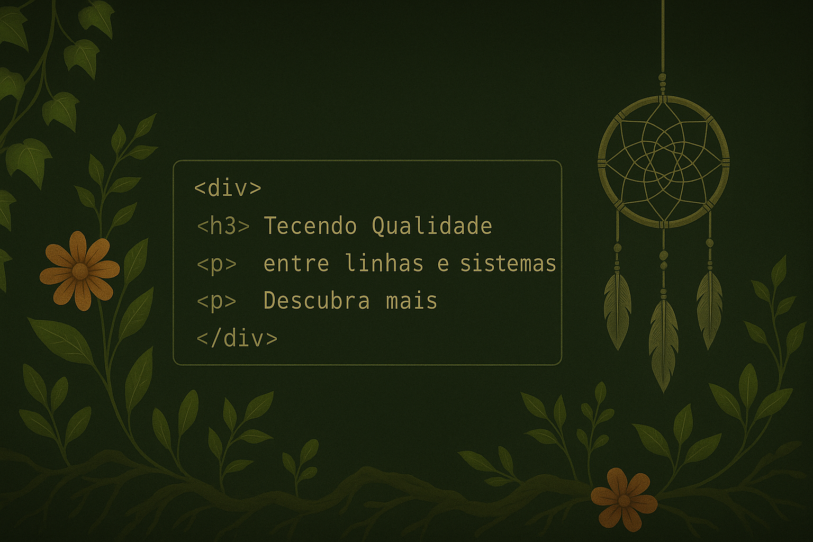
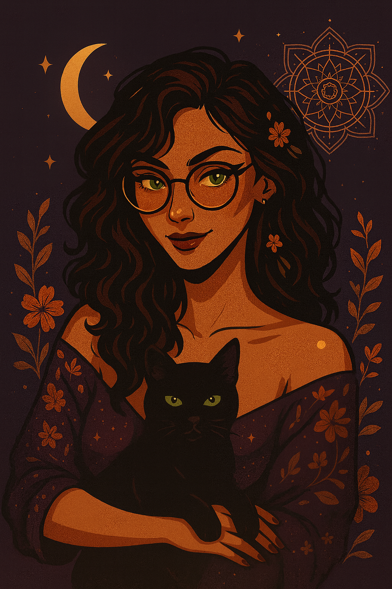

  

# Olá, eu sou a Diane • Software Quality & Criatividade

"Assim como cada ponto no crochê dá forma a uma peça única, cada teste bem tecido sustenta a estrutura de um sistema.”

Sou curiosa, detalhista e adoro transformar coisas simples em algo especial.
Trabalho na área de qualidade de software, com um olhar curioso, atenção aos detalhes e leveza no processo. Mas não vivo só de tecnologia: também tenho meu lado criativo, onde coloco as mãos no crochê para criar mandalas, filtros dos sonhos e peças cheias de cor no meu projeto Flor de Novembro.
Gosto de olhar pela perspectiva de que o artesanato combina muito com a qualidade. **Cada** ponto importa, cada pixel pode fazer a diferença. O artesanato me ajudou a ser a QA que sou hoje e a prestar atenção em cada ponto pensando na entrega final, onde nos dois a qualidade é fundamental 🌷

Sou mãe do Gael 💙, meu pequeno parceiro de aventuras, jogos, descobertas e ajuda na caça aos bugs.

<table>
<tr>
  <!-- Imagem esquerda -->
  <td width="10%" align="center">
    
  </td>

  <!-- Texto + título no meio -->
  <td width="50%" align="center">
    <h1>📬 Contatos</h1>
    

      Você pode me encontrar e acompanhar meu trabalho tanto na área de
      <strong>Qualidade de Software</strong> quanto no meu universo criativo da
      <em>Flor de Novembro</em>.
    

    
✨ Vamos tecer conexões?

    

      💼 <a href="https://linkedin.com/in/dianedematos">LinkedIn</a> |
      🌸 <a href="https://instagram.com/eujafuifofinha">Instagram</a>
    

  </td>
</tr>
</table>

---

