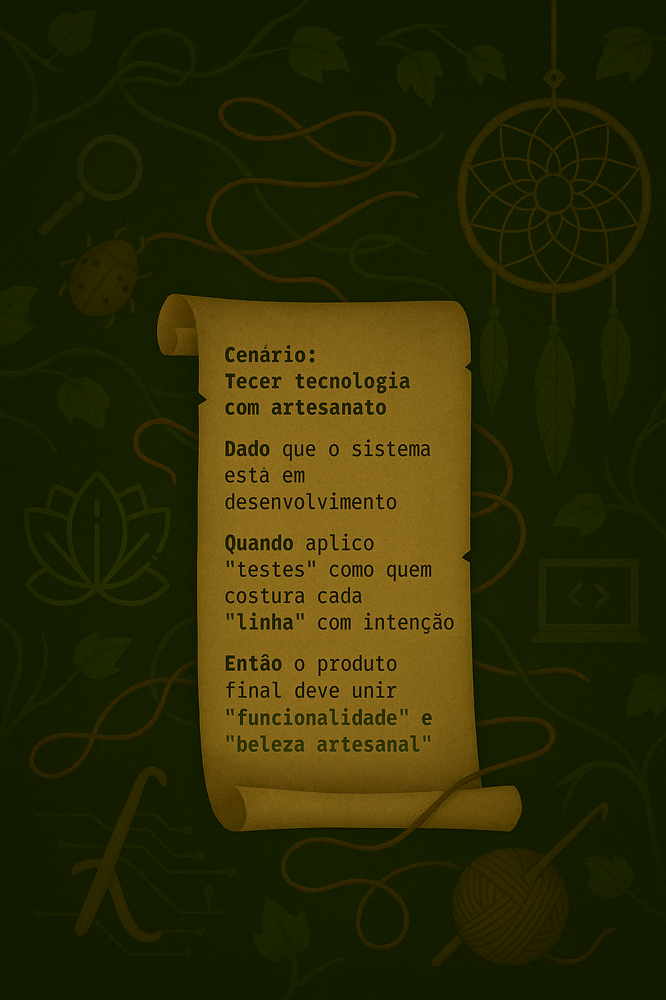
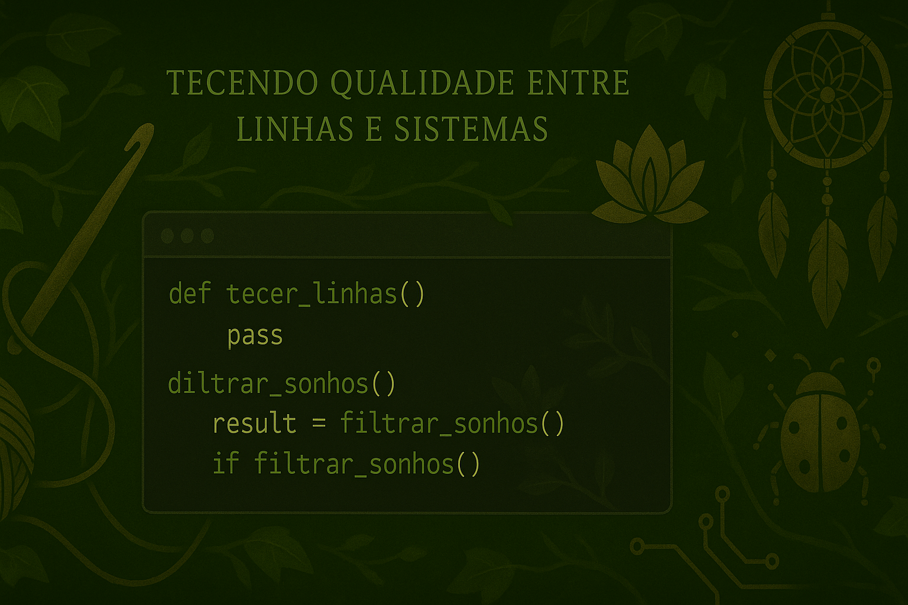
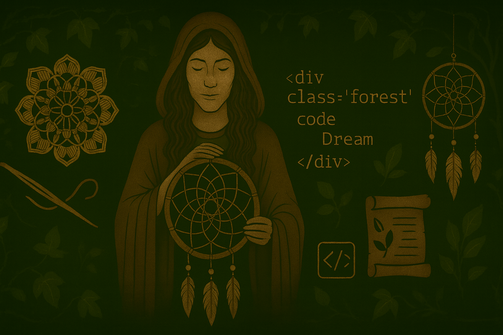

  

# 🧶 Diane — Tecendo Qualidade entre Linhas e Sistemas

> “Assim como cada ponto no crochê dá forma a uma peça única, cada teste bem tecido sustenta a estrutura de um sistema.”

Sou **Diane**, uma QA que tece qualidade entre **linhas de código, fios de crochê e sonhos digitais**.  
Unindo **técnica e sensibilidade**, atuo para construir sistemas mais harmônicos, funcionais e humanos — como quem costura um filtro dos sonhos com propósito e intenção.

---

## 🪶 Cenários Tecidos — BDD & Gherkin

<table>
  <tr>
    <td width="50%">
      
    </td>
    <td width="50%">
      
<strong>BDD e Gherkin</strong> são o tear que dá forma à minha teia de qualidade.

      <ul>
        <li>Cenários claros e legíveis conectando negócio e tecnologia</li>
        <li>Validação precisa de fluxos e jornadas</li>
        <li>Testes que revelam a intenção por trás do comportamento</li>
      </ul>
      <blockquote>
        “Cada cenário é um fio essencial que sustenta o tecido do sistema.”
      </blockquote>
    </td>
  </tr>
</table>

---

## 🪡 Automação — Tecendo Precisão com Código

<table>
  <tr>
    <td width="50%">
      
Automação é o tear que transforma intenções em resultados.

      <ul>
        <li>✨ <strong>Cypress</strong> — testes de interface e jornada do usuário</li>
        <li>🔥 <strong>Postman</strong> — invocações de APIs e contratos</li>
        <li>🌿 <strong>CI/CD</strong> — pipelines contínuos e confiáveis</li>
      </ul>
      <blockquote>
        “Cada script automatizado é um ponto reforçado na teia digital.”
      </blockquote>
    </td>
    <td width="50%">
      
    </td>
  </tr>
</table>

---

---

<table>
  <tr>
    <td width="40%">
      
    </td>
    <td width="60%">
      <h2>🌿 Vamos tecer novas conexões?</h2>
      

        Se quiser conversar sobre <strong>qualidade de software</strong>, <strong>automação</strong>, 
        <strong>testes orientados a comportamento</strong> ou simplesmente trocar ideias sobre 
        <strong>crochê, filtros dos sonhos</strong> e o elo entre <strong>arte e tecnologia</strong>, 
        será um prazer me conectar com você!
      

      <ul>
        <li>💼 <a href="#">LinkedIn</a> — onde compartilho estudos e reflexões sobre QA</li>
        <li>📁 <a href="#">Portfólio</a> — minha coleção de projetos e experimentos</li>
        <li>📬 <a href="mailto:seuemail@exemplo.com">E-mail</a> — fale diretamente comigo</li>
      </ul>
      <blockquote>
        “A tecnologia se torna mais humana quando é tecida com intenção.”
      </blockquote>
    </td>
  </tr>
</table>

